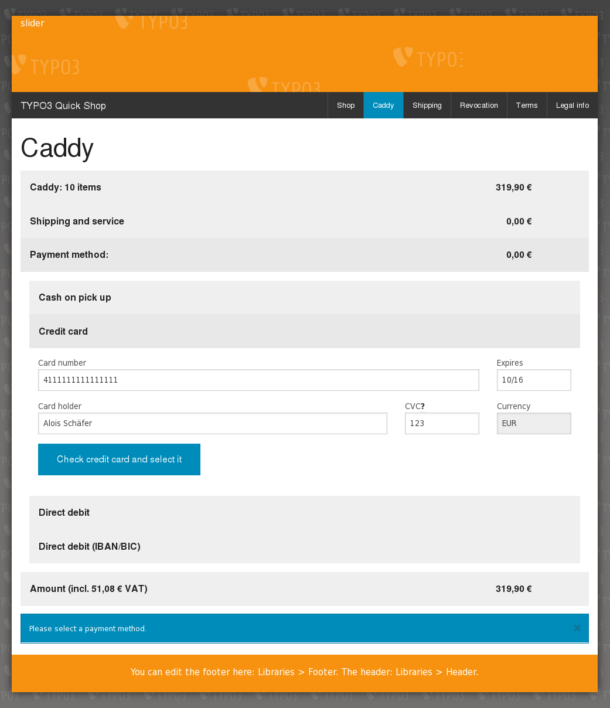
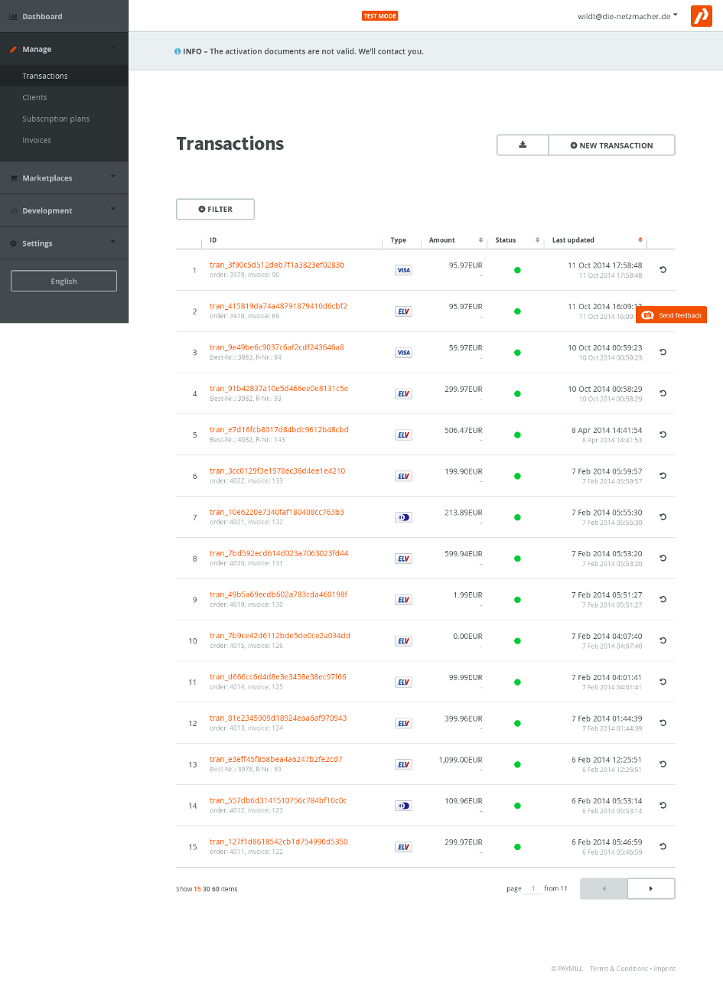

.. ==================================================
.. FOR YOUR INFORMATION
.. --------------------------------------------------
.. -*- coding: utf-8 -*- with BOM.

.. include:: ../Includes.txt

.. _epayment-1:

E-Payment
=========

<draw:text-box draw:style-name="fr2" draw:name="Frame29" text:anchor-type="as-char" svg:width="8cm"
draw:z-index="0" fo:min-height="4.923cm">|image-45| Illustration <text:sequence
text:ref-name="refIllustration22" text:name="Illustration" text:formula="Illustration+1"
style:num-format="1">23</text:sequence>: Caddy with e-payment interface</draw:text-box>
<draw:text-box draw:style-name="fr2" draw:name="Frame52" text:anchor-type="as-char" svg:width="8cm"
draw:z-index="0" fo:min-height="4.923cm">|image-42| Illustration <text:sequence
text:ref-name="refIllustration23" text:name="Illustration" text:formula="Illustration+1"
style:num-format="1">24</text:sequence>: Transactions</draw:text-box>

Caddy supports e-payment.

.. toctree::
    :maxdepth: 2
    :titlesonly:

    Setup/Index
    Live/Index
    Requirements/Index
