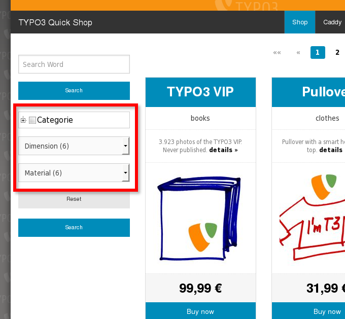
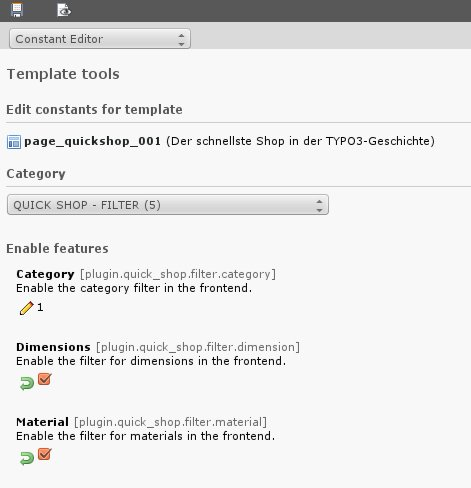

.. ==================================================
.. FOR YOUR INFORMATION
.. --------------------------------------------------
.. -*- coding: utf-8 -*- with BOM.

.. include:: ../../../Includes.txt

.. _illustration-18-page-page-quick-shop-filter:

Filter
^^^^^^

<draw:text-box draw:style-name="fr2" draw:name="Frame17" text:anchor-type="as-char"
svg:width="6.37cm" draw:z-index="20" fo:min-height="6.228cm">|image-41| Illustration <text:sequence
text:ref-name="refIllustration18" text:name="Illustration" text:formula="Illustration+1"
style:num-format="1">19</text:sequence>: Filter category, dimension material</draw:text-box>
<draw:text-box draw:style-name="fr2" draw:name="Frame16" text:anchor-type="as-char"
svg:width="5.691cm" draw:z-index="22" fo:min-height="6.013cm">|image-7| Illustration <text:sequence
text:ref-name="refIllustration19" text:name="Illustration" text:formula="Illustration+1"
style:num-format="1">20</text:sequence>: TypoScript Constant Editor</draw:text-box>

You enable and disable the display of each filter supported by the TypoScript Constant Editor.
