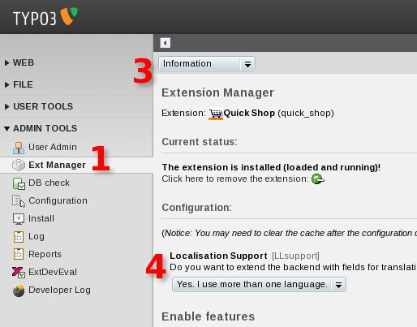

.. ==================================================
.. FOR YOUR INFORMATION
.. --------------------------------------------------
.. -*- coding: utf-8 -*- with BOM.

.. include:: ../../Includes.txt

.. _localisation-extension-manager:

Extension Manager
-----------------

<draw:text-box draw:style-name="fr2" draw:name="Frame11" text:anchor-type="as-char" svg:width="10cm"
draw:z-index="52" fo:min-height="7.83cm">|image-11| Illustration <text:sequence
text:ref-name="refIllustration33" text:name="Illustration" text:formula="Illustration+1"
style:num-format="1">34</text:sequence>: Enable localisation support</draw:text-box>

You enable the localisation support with the extension manager:

#. Web modul > Admin Tools > Ext Manager
#. Please select the extension <text:title>Quick Shop</text:title>
#. Menu [Information]
#. Localisation Support [Yes, I use more than one language]
