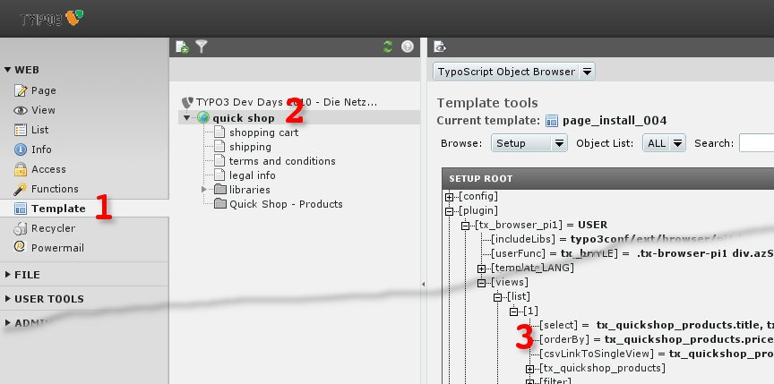

.. ==================================================
.. FOR YOUR INFORMATION
.. --------------------------------------------------
.. -*- coding: utf-8 -*- with BOM.

.. include:: ../../Includes.txt

.. _ordering-of-products-default-order:

Default Order
-------------

<draw:text-box draw:style-name="fr2" draw:name="Frame3" text:anchor-type="as-char"
svg:width="17.7cm" draw:z-index="0" fo:min-height="8.788cm">|image-17| Illustration <text:sequence
text:ref-name="refIllustration28" text:name="Illustration" text:formula="Illustration+1"
style:num-format="1">29</text:sequence>: The products will be ordered by TypoScript</draw:text-box>

The order of the products is configured by TypoScript. See

plugin.tx_browser_pi1 {

...

views {

list {

1 {

select = ...

orderBy (

tx_quickshop_products.price DESC,  <text:s text:c="9"/>tx_quickshop_products.title,  <text:s
text:c="9"/>tx_quickshop_categories.title

)

}

}

}

}

If you have used the Quick Shop-Installer, products will be ordered by price (descending), title and
than the category – line in the TypoScript snippet above.

If you don't use the property "orderBy", products will be ordered by the values of the select
statement.
