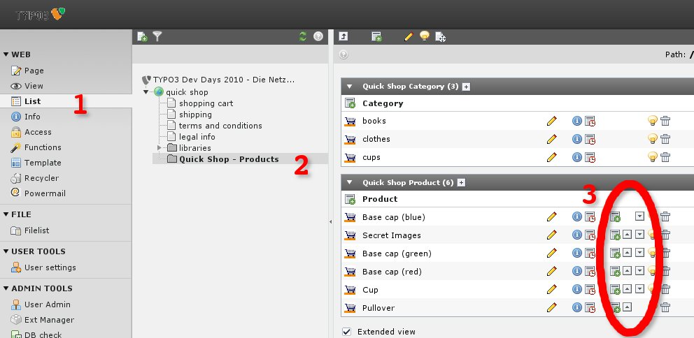
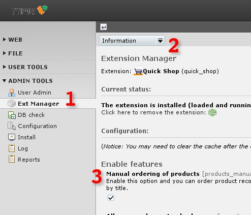

.. ==================================================
.. FOR YOUR INFORMATION
.. --------------------------------------------------
.. -*- coding: utf-8 -*- with BOM.

.. include:: ../../Includes.txt

.. _ordering-of-products-order-manually-by-the-field:

Order manually – by the field sorting
-------------------------------------

This section ins't checked in Quick Shop version 6.x. Maybe the documentation below isn't proper.

<draw:text-box draw:style-name="fr2" draw:name="Frame4" text:anchor-type="as-char"
svg:width="17.7cm" draw:z-index="0" fo:min-height="8.634cm">|image-22| Illustration <text:sequence
text:ref-name="refIllustration29" text:name="Illustration" text:formula="Illustration+1"
style:num-format="1">30</text:sequence>: Order Products by the field sorting</draw:text-box>

You can order your products manually like in the illustration above.

<draw:text-box draw:style-name="fr2" draw:name="Frame5" text:anchor-type="as-char" svg:width="8cm"
draw:z-index="0" fo:min-height="7.999cm">|image-8| Illustration <text:sequence
text:ref-name="refIllustration30" text:name="Illustration" text:formula="Illustration+1"
style:num-format="1">31</text:sequence>: Extension Manager</draw:text-box>

Please enable the sorting field with the extension manager - see the illustration above.

.. toctree::
    :maxdepth: 2
    :titlesonly:

    Typoscript2/Index
    HtmlTemplate/Index
