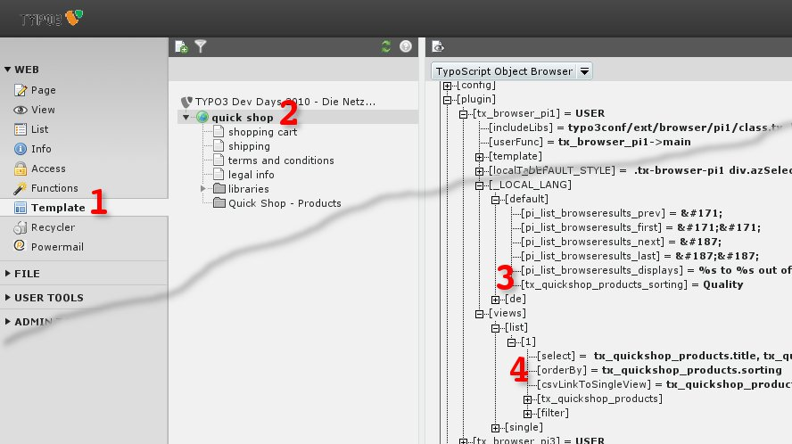

.. ==================================================
.. FOR YOUR INFORMATION
.. --------------------------------------------------
.. -*- coding: utf-8 -*- with BOM.

.. include:: ../../../Includes.txt

.. _ordering-of-products-order-manually-by-the-field-typoscript-2:

TypoScript
^^^^^^^^^^

Please configure your TypoScript like in the snippet below.

plugin.tx_browser_pi1 {

views {

list {

1 {

orderBy = tx_quickshop_products.sorting

}

}

}

_LOCAL_LANG {

default {

tx_quickshop_products_sorting = Quality

}

}

}

<draw:text-box draw:style-name="fr2" draw:name="Frame6" text:anchor-type="as-char"
svg:width="17.7cm" draw:z-index="0" fo:min-height="9.925cm">|image-19| Illustration <text:sequence
text:ref-name="refIllustration31" text:name="Illustration" text:formula="Illustration+1"
style:num-format="1">32</text:sequence>: Labelling and sorting by TypoScript</draw:text-box>

#. Modul: Web > Template
#. Page tree: Root page
#. Edit area: TypoScript Object Browser  <text:s
   text:c="15"/>plugin.tx_browser_pi1._LOCAL_LANG.default.tx_quickshop_products_sorting = Quality
#. plugin.tx_browser_pi1.plugin.tx_browser_pi1.views.list.1.orderBy = tx_quickshop_products.sorting
