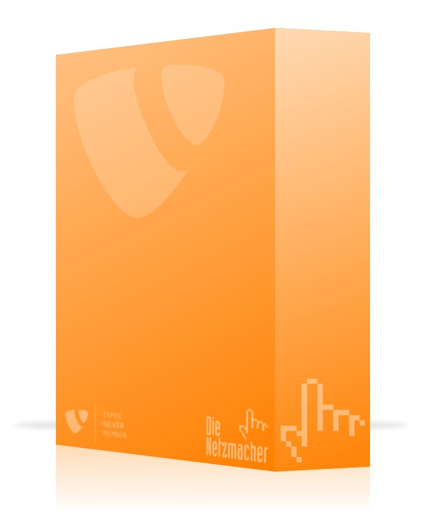

.. ==================================================
.. FOR YOUR INFORMATION
.. --------------------------------------------------
.. -*- coding: utf-8 -*- with BOM.

.. include:: ../../Includes.txt

.. _packages-for-sponsors-patron-500-eur:

Patron – 500 EUR
----------------

|image-13| You are the patron. You are treating TYPO3 Quick Shop project and you like to pay the
developer more than best for two hours service.

Your logo will appear in the manual, at the website and in the extension manager of Quick Shop.

You can book the developer of Quick Shop for two hours. 

The period of validity for both – the logo and the two hours – is limited to one year. If you
don't use the two hours in this period, you will lost it. 

You will get a receive. You can set the amount off against tax liability. 

You can pay more than 500 EUR.
