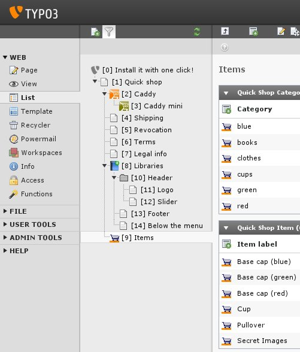
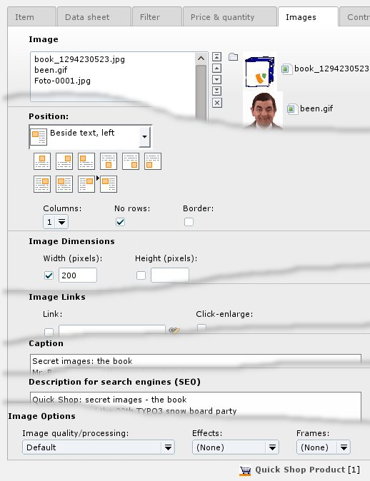
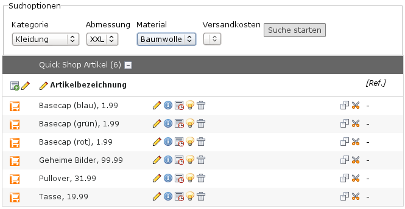
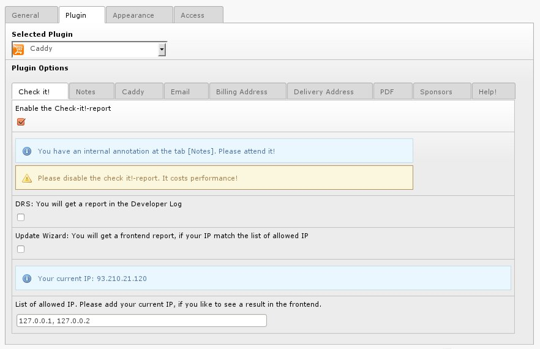

.. ==================================================
.. FOR YOUR INFORMATION
.. --------------------------------------------------
.. -*- coding: utf-8 -*- with BOM.

.. include:: ../../Includes.txt

.. _screen-shots-backend:

Backend
-------

<draw:text-box draw:style-name="fr2" draw:name="Frame2" text:anchor-type="as-char" svg:width="8cm"
draw:z-index="0" fo:min-height="9.389cm">|image-9| Illustration <text:sequence
text:ref-name="refIllustration6" text:name="Illustration" text:formula="Illustration+1"
style:num-format="1">7</text:sequence>: Quick Shop – list view categories and
items</draw:text-box> <draw:text-box draw:style-name="fr2" draw:name="Frame8"
text:anchor-type="as-char" svg:width="8cm" draw:z-index="2" fo:min-height="9.389cm">|image-12|
Illustration <text:sequence text:ref-name="refIllustration7" text:name="Illustration"
text:formula="Illustration+1" style:num-format="1">8</text:sequence>: Quick Shop – Individual
layout for each item</draw:text-box>

<draw:text-box draw:style-name="fr2" draw:name="Frame25" text:anchor-type="as-char" svg:width="8cm"
draw:z-index="4" fo:min-height="4.396cm">|image-14| Illustration <text:sequence
text:ref-name="refIllustration8" text:name="Illustration" text:formula="Illustration+1"
style:num-format="1">9</text:sequence>: Searchform in the Backend – <text:alphabetical-index-mark
text:string-value="Backend" text:key1="Filter"/><text:alphabetical-index-mark
text:string-value="Backend filter" text:key1="Backend"/><text:alphabetical-index-mark
text:string-value="Search form" text:key1="Backend"/>backend filter</draw:text-box>

<draw:text-box draw:style-name="fr2" draw:name="Frame12" text:anchor-type="as-char" svg:width="8cm"
draw:z-index="6" fo:min-height="9.389cm">|image-10| Illustration <text:sequence
text:ref-name="refIllustration9" text:name="Illustration" text:formula="Illustration+1"
style:num-format="1">10</text:sequence>: Controlling the frontend by the Browser
plugin</draw:text-box> <draw:text-box draw:style-name="fr2" draw:name="Frame9"
text:anchor-type="as-char" svg:width="8cm" draw:z-index="8" fo:min-height="5.408cm">|image-18|
Illustration <text:sequence text:ref-name="refIllustration10" text:name="Illustration"
text:formula="Illustration+1" style:num-format="1">11</text:sequence>: Controlling the Caddy with
the Caddy plugin</draw:text-box>

.. |image-10| image:: ../../Images/image-10.jpg

