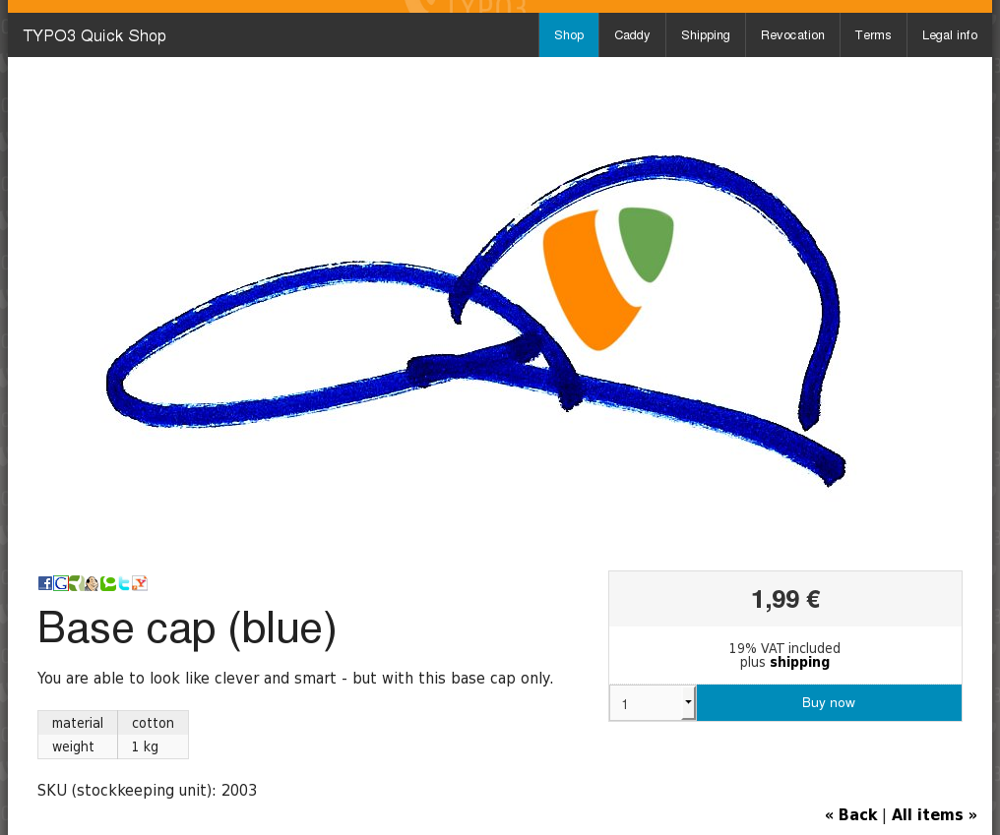
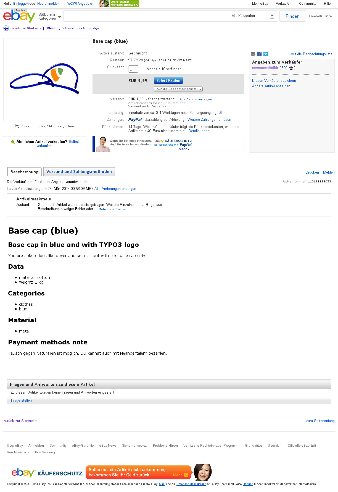

.. ==================================================
.. FOR YOUR INFORMATION
.. --------------------------------------------------
.. -*- coding: utf-8 -*- with BOM.

.. include:: ../../Includes.txt

.. _screen-shots-ebay-interface:

ebay Interface
--------------

<draw:text-box draw:style-name="fr2" draw:name="Frame18" text:anchor-type="as-char" svg:width="8cm"
draw:z-index="14" fo:min-height="6.96cm">|image-44| Illustration <text:sequence
text:ref-name="refIllustration14" text:name="Illustration" text:formula="Illustration+1"
style:num-format="1">15</text:sequence>: The item on Quick Shop (sample)</draw:text-box>
<draw:text-box draw:style-name="fr2" draw:name="Frame19" text:anchor-type="as-char" svg:width="8cm"
draw:z-index="16" fo:min-height="6.96cm">|image-24| Illustration <text:sequence
text:ref-name="refIllustration15" text:name="Illustration" text:formula="Illustration+1"
style:num-format="1">16</text:sequence>: The item on ebay (sample)</draw:text-box>

You can enable an ebay interface. See requirements and details at "<text:bookmark-ref
text:reference-format="text" text:ref-name="__RefHeading__19737_1665048749">ebay
Interface</text:bookmark-ref>" on page <text:bookmark-ref text:reference-format="page"
text:ref-name="__RefHeading__19737_1665048749">24</text:bookmark-ref> <text:bookmark-ref
text:reference-format="direction"
text:ref-name="__RefHeading__19737_1665048749">below</text:bookmark-ref>.
