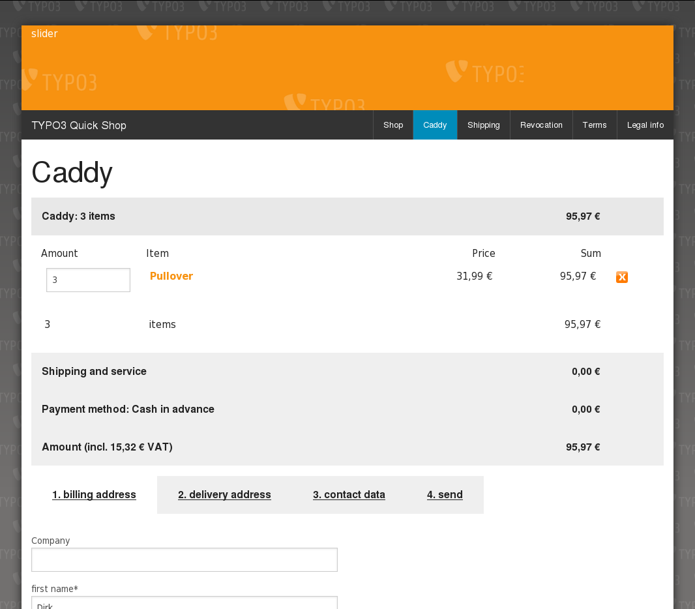
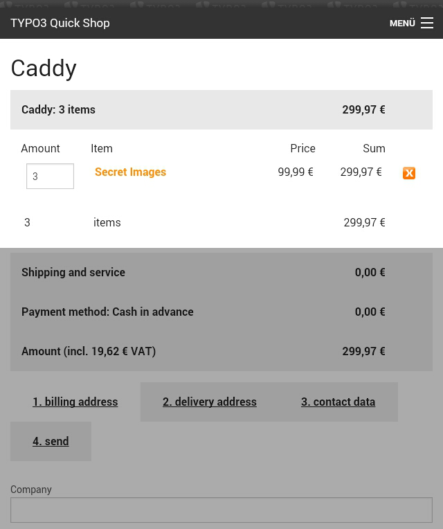
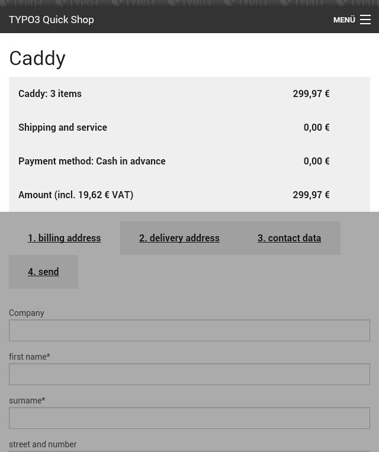

.. ==================================================
.. FOR YOUR INFORMATION
.. --------------------------------------------------
.. -*- coding: utf-8 -*- with BOM.

.. include:: ../../../Includes.txt

.. _screen-shots-frontend-caddy:

Caddy
^^^^^

<draw:text-box draw:style-name="fr1" draw:name="Frame22" text:anchor-type="as-char"
svg:width="6.591cm" draw:z-index="207" fo:min-height="6.262cm">|image-47| Illustration
<text:sequence text:ref-name="refIllustration3" text:name="Illustration"
text:formula="Illustration+1" style:num-format="1">4</text:sequence>: Caddy on the
desktop</draw:text-box> <draw:text-box draw:style-name="fr1" draw:name="Frame21"
text:anchor-type="as-char" svg:width="5.032cm" draw:z-index="209" fo:min-height="6.597cm">|image-39|
Illustration <text:sequence text:ref-name="refIllustration4" text:name="Illustration"
text:formula="Illustration+1" style:num-format="1">5</text:sequence>: Caddy with an opened accordion
on the smartphone</draw:text-box> <draw:text-box draw:style-name="fr1" draw:name="Frame13"
text:anchor-type="as-char" svg:width="5.032cm" draw:z-index="211" fo:min-height="6.535cm">|image-40|
Illustration <text:sequence text:ref-name="refIllustration5" text:name="Illustration"
text:formula="Illustration+1" style:num-format="1">6</text:sequence>: Caddy with a clodsed accordion
on the smartphone</draw:text-box>

The example will be the result, if you are installing the Quick Shop with the Quick Shop Installer
with the basic template option.

See Quick Shop live on `http://typo3-quick-shop.de <http://typo3-quick-shop.de/>`__ 
