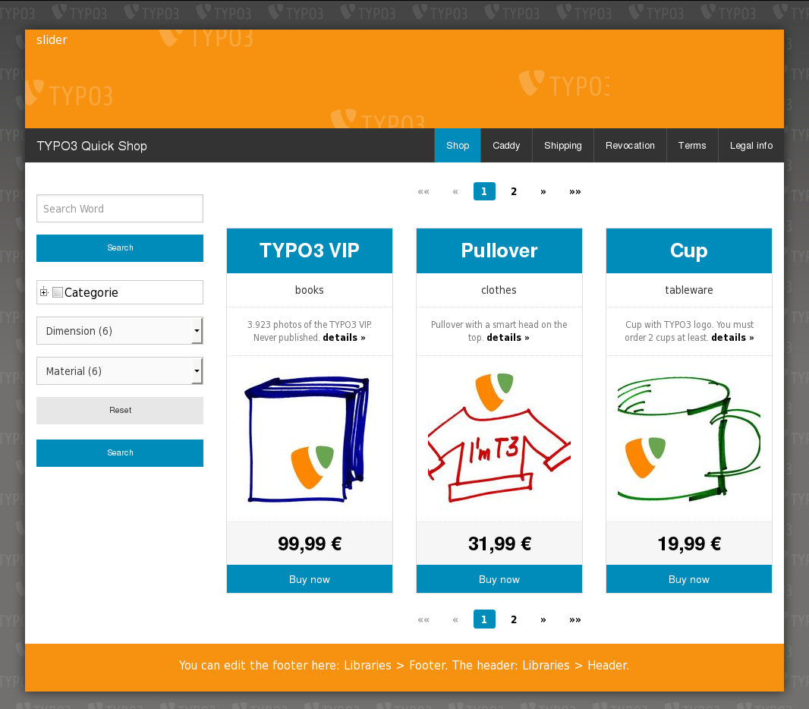
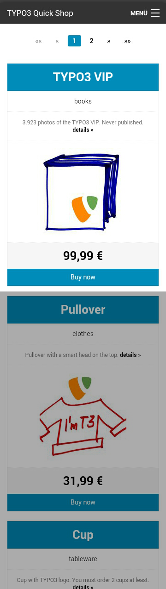
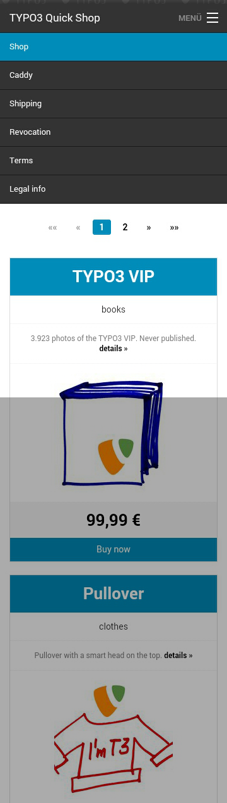

.. ==================================================
.. FOR YOUR INFORMATION
.. --------------------------------------------------
.. -*- coding: utf-8 -*- with BOM.

.. include:: ../../../Includes.txt

.. _screen-shots-frontend-list-view-items:

List view (items)
^^^^^^^^^^^^^^^^^

<draw:text-box draw:style-name="fr1" draw:name="Frame28" text:anchor-type="as-char"
svg:width="9.141cm" draw:z-index="201" fo:min-height="8.338cm">|image-46| Illustration
<text:sequence text:ref-name="refIllustration0" text:name="Illustration"
text:formula="Illustration+1" style:num-format="1">1</text:sequence>: Quick Shop list view with
items on the desktop</draw:text-box> <draw:text-box draw:style-name="fr1" draw:name="Frame24"
text:anchor-type="as-char" svg:width="2.271cm" draw:z-index="203" fo:min-height="9.241cm">|image-36|
Illustration <text:sequence text:ref-name="refIllustration1" text:name="Illustration"
text:formula="Illustration+1" style:num-format="1">2</text:sequence>: List with a closed menu and an
...</draw:text-box> <draw:text-box draw:style-name="fr1" draw:name="Frame23"
text:anchor-type="as-char" svg:width="2.271cm" draw:z-index="205" fo:min-height="9.28cm">|image-37|
Illustration <text:sequence text:ref-name="refIllustration2" text:name="Illustration"
text:formula="Illustration+1" style:num-format="1">3</text:sequence>: ... opened menu on the
Smartphone</draw:text-box>

