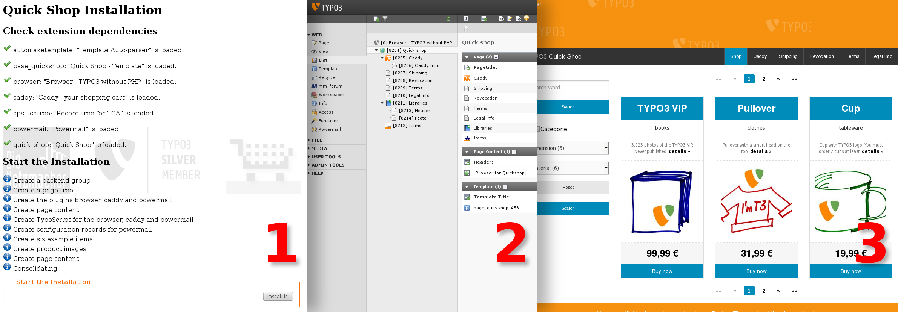

.. ==================================================
.. FOR YOUR INFORMATION
.. --------------------------------------------------
.. -*- coding: utf-8 -*- with BOM.

.. include:: ../../Includes.txt

.. _screen-shots-installation:

Installation
------------

<draw:text-box draw:style-name="fr3" draw:name="Frame15" text:anchor-type="paragraph"
svg:width="17.7cm" draw:z-index="27" fo:min-height="6.168cm">|image-49| Illustration <text:sequence
text:ref-name="refIllustration12" text:name="Illustration" text:formula="Illustration+1"
style:num-format="1">13</text:sequence>: Installation with one click: Installer (1), the result in
the backend (2) and in the frontend (3)</draw:text-box>

