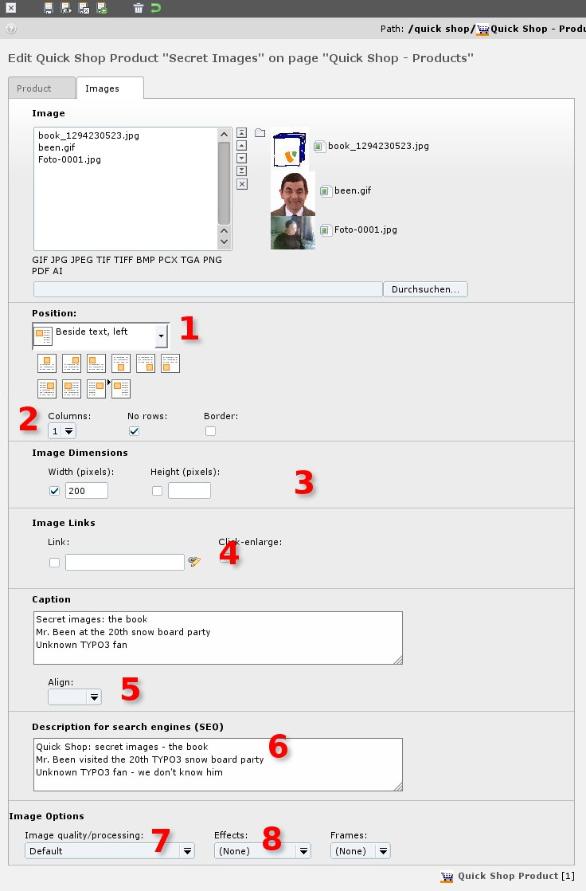

.. ==================================================
.. FOR YOUR INFORMATION
.. --------------------------------------------------
.. -*- coding: utf-8 -*- with BOM.

.. include:: ../../../Includes.txt

.. _whats-new-2x-individual-layout-for-each:

Individual layout for each product
^^^^^^^^^^^^^^^^^^^^^^^^^^^^^^^^^^

<draw:text-box draw:style-name="fr6" draw:name="Frame20" text:anchor-type="paragraph"
svg:x="5.699cm" svg:y="0.058cm" svg:width="12.001cm" draw:z-index="24"
fo:min-height="15.431cm">|image-15| Illustration <text:sequence text:ref-name="refIllustration34"
text:name="Illustration" text:formula="Illustration+1" style:num-format="1">35</text:sequence>: The
new tab [Images]</draw:text-box>[2.0.0]

You can layout all product differently:

#. Select a position for your images with text: - above, - below, - in text right, - or, or, or ...
#. Columns: How many do you like? 1, 2 or 7?
#. Image dimensions: Take the width and height you need.
#. Every image can get a different link.
#. Captions alignment
#. SEO: Search Engine Optimisation
#. Image quality
#. Image effects
